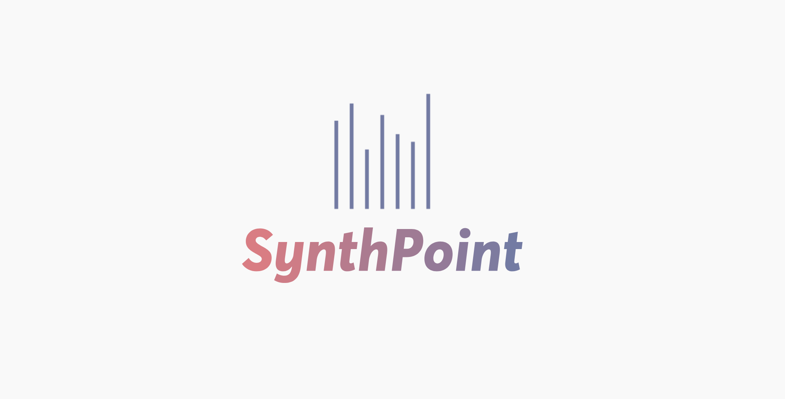

<h1 align="center">
  
</h1>

  

  
    

  <a href="#key-features">Key Features</a> •
  <a href="#howto">How To Use</a> •
  <a href="#credits">Credits</a>

<h1 align="center"> Check it out at: <a href="https://synthpoint.tech">synthpoint.tech </a> </h1>

<a name="key-features">
<h1 align="center"> Key Features</h1>
<ul>
<li> LightWeight React PWA </li>
<li> Change Notes by Moving Phone </li>
<li> Multiple Instruments & Effects </li>
</ul>

<a name="howto">
<h1 align="center"> How To Use </h1>
<ul>

<li> Visit <a href="https://synthpoint.tech">synthpoint.tech </a> </li>
<li> Optionally press on the three dot menu and click on Add to HomeScreen to Install PWA </li>
<li> Press on notes on screen while moving phone to compose music </li>
<li> Press on the Dot on Top Right to open Effects & Instruments Menu</li>

</ul>

<h1 align="center"> Screenshots</h1>
  
  
  